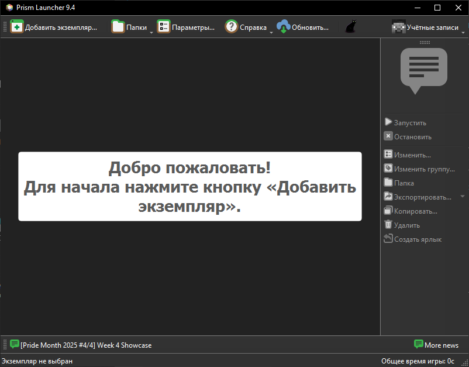
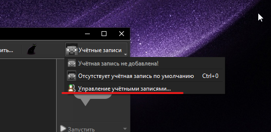
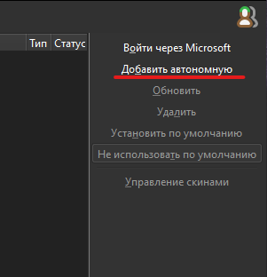

# Dustpack


## Гайд по установке

### 1. Установка Prism Launcher

Если лаунчер уже установлен — переходите к [пункту 2](#2-установка-модпака).

- **Для лицензионных аккаунтов**:  
  Скачайте с официального сайта: [prismlauncher.org/download](https://prismlauncher.org/download/).  
  Добавьте свою Microsoft-учётную запись в лаунчере.

- **Для пиратских версий**:  
  Скачайте cracked-версию: [github.com/Diegiwg/PrismLauncher-Cracked](https://github.com/Diegiwg/PrismLauncher-Cracked) (выберите релиз под вашу ОС).  
  При настройке, когда предложат привязать аккаунт Microsoft — нажмите **"Завершить"** в правом нижнем углу.

После установки увидите главный экран:





**Добавление никнейма (offline-режим для пиратов)**:

<div style="display: flex; justify-content: center; gap: 30px; flex-wrap: wrap;">
  <div style="text-align: center;">
    
    <p>Меню управления аккаунтами</p>
  </div>
  <div style="text-align: center;">
    
    <p>Добавление offline-аккаунта</p>
  </div>
</div>

### 2. Установка Модпака

1. На главном экране нажмите правой кнопкой мыши в пустой области → **Add Instance** (Создать экземпляр).


2. Перейдите во вкладку **Импорт** и вставьте ссылку:

```
https://github.com/Zeragorn-ru/dustpack/releases/latest/download/dustpack.mrpack
```

Нажмите **OK**. Начнётся загрузка.


3. После загрузки дважды кликните по экземпляру — запустится Minecraft.  
   Первый запуск может занять время (устанавливаются моды).

Готово!

Проблемы? Пишите в Issues репозитория.
